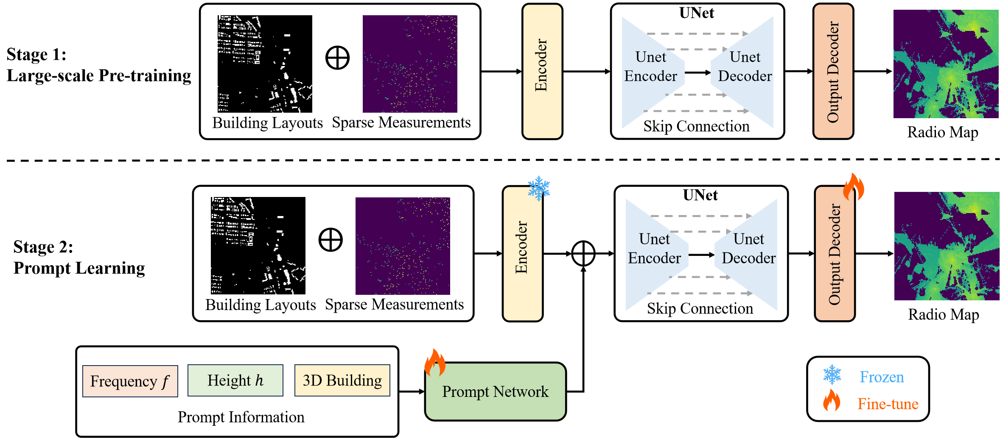

## UniRM: A Universal Large Model for Multiband 3D Radio Map Construction

The official implementation of "UniRM: A Universal Large Model for Multiband 3D Radio Map Construction". 

In this project, we propose a novel framework, UniRM, which leverages large-scale pre-training and prompt learning techniques to accurately generate radio maps across diverse environments, altitudes, and frequency bands. UniRM not only establishes a new state-of-the-art in radio map construction but also serves as a scalable and extensible foundation for future wireless communication applications.
## Installation
### Environment
- Tested OS: Linux
- Python >= 3.10
- torch == 2.5.1
- torch_geometric == 2.2.0

## Data
The data used for training and evaluation can be found in [SpectrumNet](https://spectrum-net.github.io/).
After downloading the data, move the npz and png folders to ./data.
All the data path can be found in ./dataset

## Model Training

To train UniRM, run: ``prompt_unet_main.py``
### Stage-1: Pre-training
- For Pre-train, set stage=0, enable_prompt=0,file_load_path=''

### Stage-2: Prompt-tuning
- For Prompt-tuning, set stage=1, enable_prompt=1,file_load_path='the saved path of the pretrained model'

## 📧 Contact

If you have any questions or want to use the code, feel free to contact:
* Jiang Xinyue (xyuejiang@hnu.edu.cn, shirleyuue@foxmail.com)
